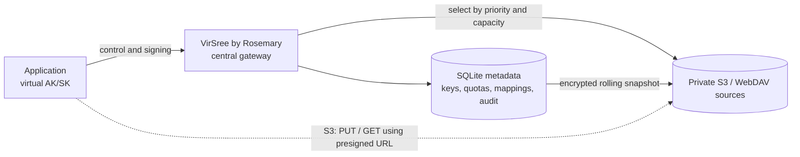

# VirSree by Rosemary

[](https://github.com/Foodie05/rosemary-virsree/actions/workflows/ci.yml)
[](https://github.com/Foodie05/rosemary-virsree/releases)
[](LICENSE)

VirSree by Rosemary is a virtual S3 control plane for applications that should never receive physical storage credentials. Applications receive virtual access keys and isolated bucket names. Operators can attach multiple private S3 or WebDAV sources; VirSree enforces permissions and quotas, stores each logical-to-physical mapping, and allocates new objects by source priority and available capacity.

All control traffic enters one gateway:

- `/api/v1` — administration, onboarding, direct-transfer signing, quota and link operations
- `/s3` — SigV4-authenticated S3-compatible object operations
- `/p` — stable public aliases that resolve to a fresh storage capability URL

S3 upload and download bytes go directly between the application and the real S3 or compatible CDN endpoint after signing. Generic WebDAV has no presigned URL standard, so WebDAV file bytes use short-lived VirSree relay capabilities and API responses explicitly report `direct: false`.

## Architecture



The real key is opaque and generation-based, for example `rosemary/bkt_x/g123/reports/q3.pdf`. Applications only see `reports/q3.pdf` in their virtual bucket.

## Run locally

Requirements: Go 1.24+, Node 22+, and pnpm.

```bash
cp .env.example .env
# Configure OIDC, the administrator email allowlist, and long random values
# for RVS_ADMIN_TOKEN and RVS_MASTER_KEY. Storage is added in browser OOBE.
set -a; source .env; set +a

cd web && pnpm install && pnpm build && cd ..
go run ./cmd/server
```

Open `http://127.0.0.1:8080` and log in through the configured OIDC provider using an allowlisted email. A fresh database starts the guided **Welcome → storage source → console** OOBE. `RVS_ADMIN_TOKEN` remains available for administrative automation; it is not the browser login.

The console provides capacity overview, virtual-bucket creation and resizing, unlimited source/bucket modes, detailed endpoint and status inspection, object browsing and operations, four independent key permissions, one-click Agent prompts, and configuration guidance. Object downloads opened from the console still go directly to S3 and require the operator to choose the signature duration.

The highest-priority source also hosts VirSree's reserved `virsree-system/v1/` filesystem. By default, VirSree writes a consistent, compressed, AES-256-GCM encrypted SQLite snapshot every six hours and rotates across seven fixed slots. The snapshot includes audit records, virtual-to-physical mappings and encrypted credential records. The storage source page reports backup health. Keep `RVS_MASTER_KEY` in an independent secure backup because storage snapshots cannot decrypt themselves.

Every physical bucket or WebDAV collection must already exist and remain private. VirSree does not expose physical credentials to applications. See [the operator setup guide](docs/operator-setup.md) for OIDC, multi-source allocation, S3-compatible CDN rules and the WebDAV transfer boundary.

The platform identity needs object-level `GetObject`, `PutObject`, and `DeleteObject` access under the `rosemary/` and `rosemary-staging/` prefixes; server-side promotion and link invalidation use the same read/write permissions. Configure an 8-day lifecycle expiration for `rosemary-staging/` so interrupted or reused upload URLs cannot leave temporary objects indefinitely. Browser applications also need the backing bucket's CORS policy to allow their origins, `GET`, `HEAD`, `PUT`, and the headers they send, because signed object traffic bypasses the gateway.

## Direct upload

The application chooses the expiry for every signature. There is no platform business default.

```bash
curl -sS -X POST "$GATEWAY/api/v1/buckets/$BUCKET/objects/upload" \
  -H "X-RVS-Access-Key: $RVS_ACCESS_KEY" \
  -H "X-RVS-Secret-Key: $RVS_SECRET_KEY" \
  -H 'Content-Type: application/json' \
  -d '{"key":"images/cover.webp","size":284190,"content_type":"image/webp","expires_in":600}'
```

The response contains a real S3 staging `url`, an `upload_id`, and a `commit_url`. The signature binds the declared byte length. `PUT` the bytes to that real S3 `url`, then POST `{"upload_id":"...","key":"images/cover.webp"}` to `commit_url`. Commit verifies the object, copies it to a fresh final physical key, switches metadata, and removes staging before charging used space. Applications must not call `PutObject` against VirSree's `/s3` endpoint.

## Direct download

```bash
curl -sS -X POST "$GATEWAY/api/v1/buckets/$BUCKET/objects/download" \
  -H "X-RVS-Access-Key: $RVS_ACCESS_KEY" \
  -H "X-RVS-Secret-Key: $RVS_SECRET_KEY" \
  -H 'Content-Type: application/json' \
  -d '{"key":"images/cover.webp","expires_in":900}'
```

The returned `url` points at the real private S3 endpoint. The only expiry limit imposed by VirSree is the provider/protocol limit; AWS SigV4 permits at most 604800 seconds.

## Agent onboarding

An administrator creates a one-time bootstrap token in **Agent 接入** and gives the generated prompt to an Agent. The prompt tells the Agent which trusted Release site to use; the downloaded CLI exchanges the token, creates one virtual bucket and writes its virtual credentials to a mode `0600` file without printing them:

Download `rvsctl` from [GitHub Releases](https://github.com/Foodie05/rosemary-virsree/releases/latest) for the Agent machine's OS and architecture, then verify it against `SHA256SUMS`. The generated prompt distinguishes the public source/release site from the operator's VirSree instance: applications configure their endpoint to the instance URL, never to GitHub.

```bash
rvsctl \
  -endpoint https://storage.example.com \
  -token "$ONE_TIME_TOKEN" \
  -name "Media service" \
  -bucket media-service \
  -quota 10737418240 \
  -env-file /run/secrets/rosemary.env
```

Avoiding terminal output keeps credentials out of transcripts. It does not prevent an Agent with unrestricted filesystem access from reading the destination file. In production, point an extended deployment wrapper at Vault, Kubernetes Secrets, or a cloud secret manager and deny the Agent read access to the stored value.

## Link behavior and revocation

Rotating or revoking a virtual AK/SK blocks future signing calls. It cannot invalidate real S3 presigned URLs already handed out; those URLs are self-contained and remain valid until their requested expiry.

`POST /api/v1/buckets/{bucket}/objects/invalidate-links` immediately invalidates existing direct URLs for one object. VirSree performs an S3 server-side copy to a fresh physical key, deletes the old key, and atomically updates its mapping. The logical key stays the same, while old direct URLs point to a missing physical object. Stable aliases can be revoked independently with `DELETE /api/v1/buckets/{bucket}/public-links/{slug}`.

A stable `/p/{slug}` public alias is different: each visit asks VirSree for a new real S3 signature using the application-selected `sign_expires_in` saved when the alias was created. Its redirect response uses `Cache-Control: no-store`.

## S3 compatibility boundary

The `/s3` endpoint verifies virtual AWS SigV4 requests and currently supports ListObjectsV2, HeadObject, GetObject, and DeleteObject. GetObject returns a `307` to a real signed URL. `PutObject` is deliberately rejected; use the sign-upload and commit API above before sending any body.

An arbitrary S3 SDK cannot provide fully transparent, zero-proxy uploads through a standard `PutObject` call: S3 has no protocol response that asks a client to obtain a second signed URL before it starts sending the body. VirSree therefore requires the explicit signed-upload flow. Multipart upload, versioning, tagging, lifecycle, Select, ACL, and bucket administration are not implemented in this first version. See [docs/api.md](docs/api.md) for the exact compatibility table.

## Build and deploy

Every deployment has its own gateway URL. Set `RVS_PUBLIC_URL` to the externally reachable HTTPS origin and keep `RVS_PROJECT_URL` / `RVS_RELEASE_URL` pointed at the source and CLI release location you trust. The public GitHub URL is never an application S3 endpoint.

For a single-node deployment, copy the example configuration, replace every placeholder secret and OIDC value, then build locally. Add physical storage through OOBE:

```bash
cp .env.example .env
# Edit .env. At minimum set a public RVS_PUBLIC_URL, long random
# RVS_ADMIN_TOKEN/RVS_MASTER_KEY values, and the real private S3 settings.
docker compose up -d --build
curl -fsS https://storage.example.com/health
curl -fsS https://storage.example.com/api/v1/meta
```

For the provided `storage.cruty.cn` deployment, first register the exact OIDC callback `https://storage.cruty.cn/auth/callback`, then run the local interactive uploader. It asks for the client ID, client secret and administrator email, preserves or generates the remaining secrets without printing them, installs the environment file over SSH, and restarts only VirSree:

```bash
./deploy/configure-production.sh
```

After the first OIDC login, the browser OOBE verifies and saves the initial S3 or WebDAV source. See [docs/operator-setup.md](docs/operator-setup.md) before adding a CDN endpoint.

Terminate TLS in a reverse proxy or load balancer. Persist `RVS_MASTER_KEY` independently; losing it makes both live encrypted credentials and the automatic storage snapshots unreadable. The full operator and application walkthrough is in [docs/integration.md](docs/integration.md).

```bash
make test
make build
docker build -t rosemary-virsree .
```

Persist the SQLite database and `RVS_MASTER_KEY`. Changing the master key makes stored virtual secrets unreadable. Put the gateway behind TLS in production. The S3 endpoint named by `RVS_S3_PUBLIC_ENDPOINT` must be reachable by applications because signed object traffic goes there directly.

SQLite is intended for a single gateway replica. Before horizontal scaling, move the store implementation to a transactional shared database and retain the same reservation and logical-key uniqueness rules.
